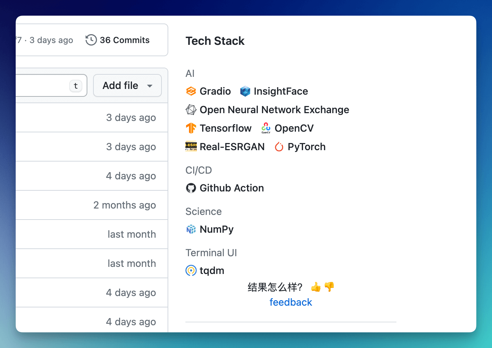
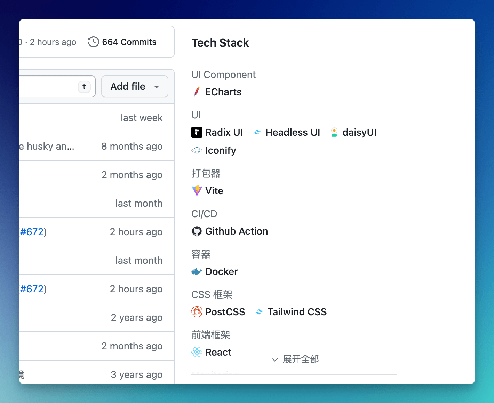

    </a>

# What is Tech Stack
Tech Stack is a browser extension that will display the tech stack of the GitHub repository you are visiting.

Tech Stack 是一个浏览器拓展，它将展示你正在访问的 GitHub 仓库的技术栈。

Discuss in [Discord](https://discord.gg/hEXF9utNHH) / [Telegram](https://t.me/gettechstack) 
    

    

Request a new tech stack in [here](https://submit-techstack.zeabur.app/). It will be add to the System as soon as possible.

 

 

## Feedback
If you have any questions or suggestions, please feel free to contact us in GitHub Issue.

如果您有任何问题或建议，请随时通过 GitHub Issue 与我们联系。

## About the TechStack
TechStack will free forever. But now open source is only one part of the TechStack. Because the Extension is running in user's browser, so we need open source to let user know what we are doing in the extension. It can ensure Don't be evil.

TechStack 将永远免费。 但现在开源只是TechStack的一部分。 因为扩展是在用户的浏览器中运行的，所以我们需要开源来让用户知道我们在扩展中做了什么。 它可以确保不作恶。